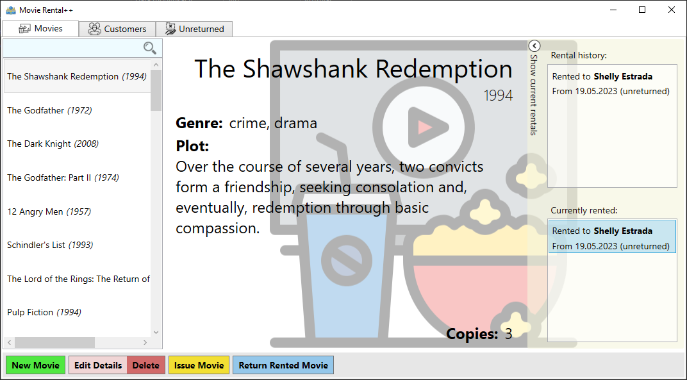
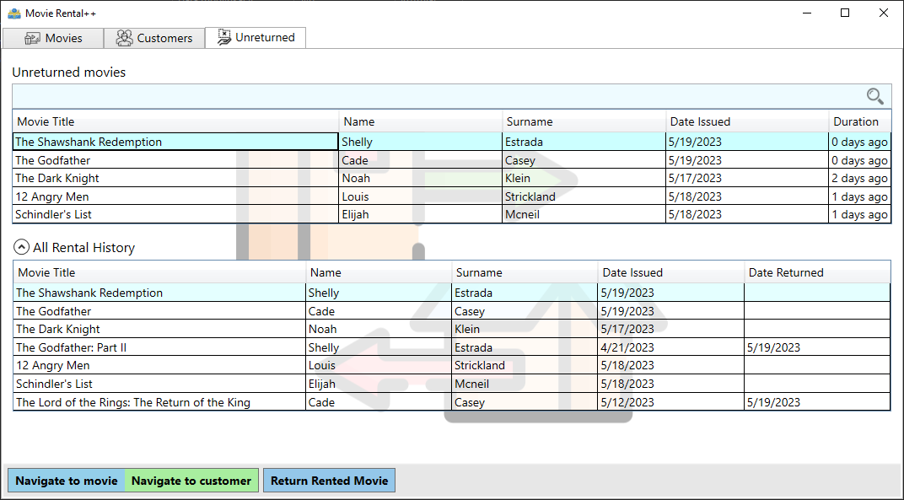

# Movie Rental Application With MVVM and Entity Framework Core

## A functional example project written in .NET 6.0 using MVVM architectural pattern

This is an example project of desktop application showing usage of MVVM
architectural pattern and Entity Framework Core with SQLite database.

At the base, MVVM's goal is to separate GUI/View from presentation logic kept
in ViewModels, as well as Models which act as database entities and data source
for most of ViewModels.

Movie Rental application utilizes various aspects of programming using MVVM
pattern in .NET framework:

* Modelling UI exclusively with XAML language, with minimal code-behind
* Using ViewModels to present all the necessary data for Views, with no
  knowledge about the view - any communication is performed using binding
  and event mechanisms built into .NET
* Separate Model classes to store and retrieve data from database
* Using Entity Framework Core for object-relational mapping and automated
  database migrations

## Screenshots

## Features used in project

Along with MVVM and EF Core, the project features usage of:

* Notifying about ViewModel changes via INotifyPropertyChanged interface
* Data validation of custom forms, with help of prepared validation code and
  INotifyDataErrorInfo interface
* Both features above contained within ViewModelBase class inherited by all
  the view models
* Commands of all kinds, to which buttons (and other controls maybe?) bind
* Custom validation attribute which validates business logic for a property
* Data converters for views for custom display of data from ViewModel
* Shared resources and styles thanks to ResourceDictionary system
* Very useful helpers like RangeObservableCollection or RelayCommand
  (kudos to people from StackOverflow for bringing these ideas!)
* Design-time ViewModels to show meaningful data for each of views
* All without external MVVM frameworks - only EF Core with SQLite support!

## Installation instructions

Requires .NET SDK 6.0 or higher to compile the project, which can be found
here: https://dotnet.microsoft.com/en-us/download.

1. Clone this repository
2. Install `dotnet-ef` package installed to apply migrations on the database -
   `dotnet tool install --global dotnet-ef`
3. Build the project, either with Visual Studio or by command line -
   `dotnet build MovieRental --configuration <release/debug>`
4. Create database and apply migrations: `dotnet ef database update`
5. Move created DB file to output folder *or* change connection string in
   `MovieRental.dll.config` after build to point to correct DB file

**NOTE:** Migrations contains code that adds example movies, customers and
rented movies, to showcase application's capabilities. If you don't want
to apply such data, remove `20230519132312_SeedExampleData.cs` and its designer
file and references in `AppDbContext.cs` to SeedData class under `Model` folder.

## Known (design) issues

* Code-behind was not fully eliminated from the project despite best efforts.
  Some stuff would require big hacks in order to remove it and keep current
  functionality intact.
* ViewModels themselves show some confirmation dialogs, which is against MVVM
  pattern (making it VM-independent would produce much more code)
* With that (and some other things), the code-base IS NOT 100%
  MVVM-pattern-compliant.  Just keep that in mind, as they say: one does not
  simply create MVVM application.
* Data in ViewModels are reloaded in full when anything in database changes.
  This might be both easy and difficult to solve - unfortunately, I haven't
  found a feasible solution myself.
* The code doesn't have exception handling except for a global one for
  dispatcher exceptions (see `App.xaml.cs` for details).

## Credits

All the icons are provided by [Flaticon](https://www.flaticon.com/).
Example movies data were data-scraped from [IMDb](https://www.imdb.com/chart/top/).

We all know it, but still - huge thanks to
[StackOverflow](https://stackoverflow.com/) community, without help of many
kind people, a lot of problems might stay unsolved or done in very ugly ways!
Thank you a lot!

## Found a bug?

It is quite unlikely I will come back to the project to change anything in it,
nor address potential issues.  Nonetheless, if you have spotted a bug or have
some ideas how to improve the code, please submit an issue using the Issues tab
above.  This might help other fellas when they face similar issues!

